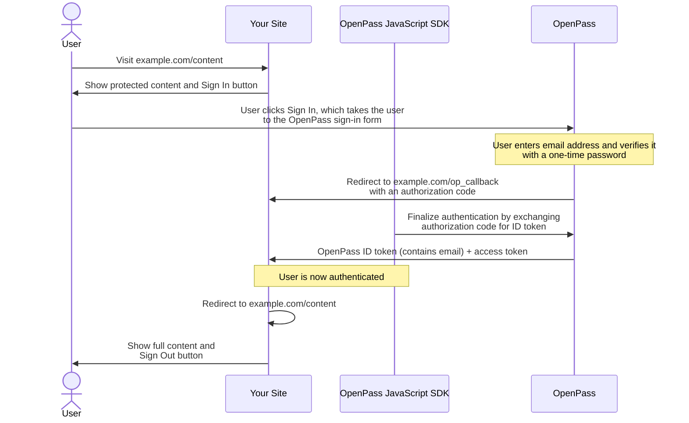

# OpenPass Developer Documentation

This page provides the following overview information about OpenPass:

* [Introduction](#introduction)
* [Audience](#audience)
* [List of Resources](#list-of-resources)
* [Sample Integration Diagram](#sample-integration-diagram)

## Introduction

OpenPass is a streamlined single sign-on ([SSO](glossary.md#sso)) universal login solution that enables consumers to view content in exchange for personalized advertising. With OpenPass, consumers can easily access content across the open internet using only their email address.

## Audience

This documentation is for developers who want to implement OpenPass on a publisher website or in an app.

## List of Resources
The following list of links provides easy access to documentation available to help you get up and running with OpenPass, whether you're using the API or an SDK:

* To understand the benefits of OpenPass, see [OpenPass Benefits for Publishers and Consumers](info/benefits.md).
* To get started, including setting up your account, see [Getting Started with OpenPass](getting-started.md).
* For SDK information, see [OpenPass SDKs](sdks/sdks.md).
* For API information, see [OpenPass API](api/v1/guide.md).
* For common terms and definitions, see [OpenPass Glossary of Terms](glossary.md).

## Sample Integration Diagram

The following diagram shows an example integration with OpenPass using the OpenPass JavaScript SDK on your website.

