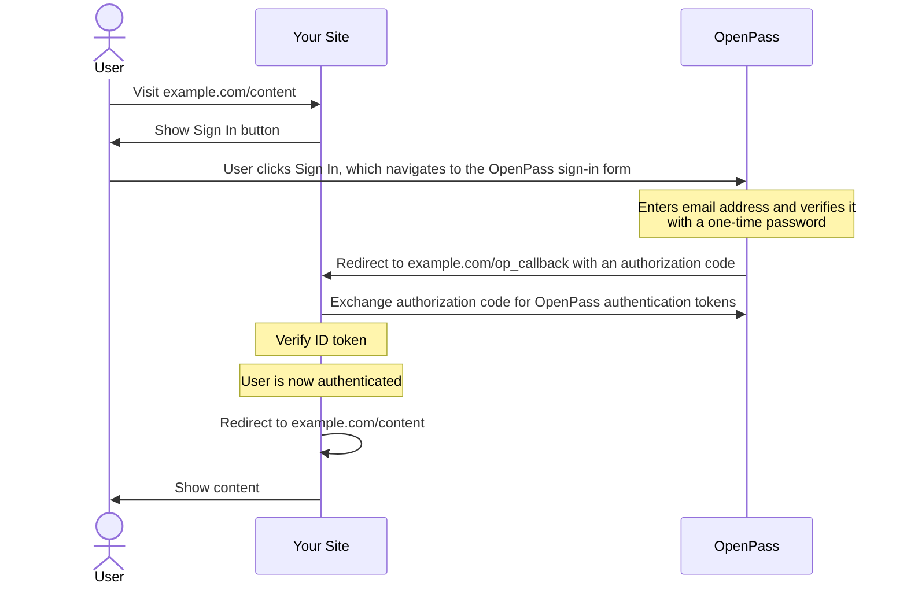
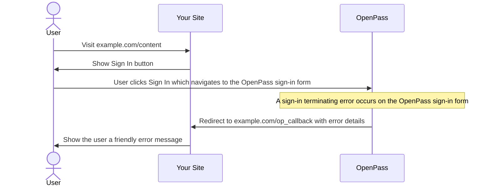
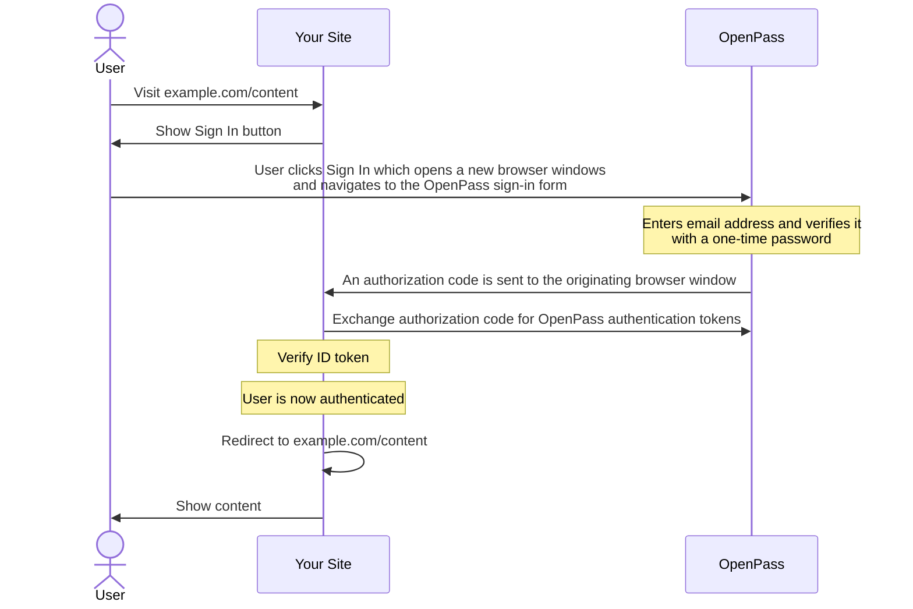

[OpenPass Developer Documentation](../README.md) > [Getting Started with OpenPass](../getting-started.md) > [Reference Information](info-summary.md) > Choosing the Right Flow: Redirect or Popup

# Choosing the Right Flow: Redirect or Popup

When integrating OpenPass on your website, you can choose between two modes:

* [Redirect](#redirect-flow): When the user clicks **Sign In**, the browser redirects the entire page to the OpenPass Universal Sign-In, and then back to your site when the user has completed the sign-in.
* [Popup](#popup-flow): When the user clicks **Sign In**, a new browser window pops up over your site for the OpenPass Universal Sign-In. When sign-in is complete, a message is sent back to your site notifying that the user has signed in.

## Redirect Flow

This flow does a full-page redirect to the OpenPass sign-in form. On successful authentication, OpenPass redirects the user back to your site, where you must complete the authentication flow.

A successful redirect flow follows these steps:

1. When the user initiates the sign-in authentication flow (usually by clicking a **Sign In With OpenPass** button), the user is redirected to the OpenPass sign-in form at the [GET /v1/api/authorize](/api/v1/api-reference.md#get-v1apiauthorize) endpoint.
2. OpenPass prompts the user to enter an email and verify the account with a one-time password, or to use an existing email if the user has signed in with OpenPass before.
3. After authentication, OpenPass redirects the user back to your site, with an authorization code. The authorization code is exchanged for OpenPass authentication tokens (ID token and access token) by sending the authorization code to the [POST /v1/api/token](/api/v1/api-reference.md#post-v1apitoken) endpoint.
4. The ID token is then verified, and the authentication process is complete. At this point you can redirect back to the page where the user initiated the sign-in process.

The following diagram illustrates the basic steps of the redirect flow.

### Handling Authentication Failure

In most cases authentication is successful, but there are some scenarios where it might not be successful. For example, there might be an invalid `redirect_uri` parameter, an incorrect client ID value, or a connectivity issue.

There are three possible error outcomes:

* OpenPass user errors (such as entering the wrong one-time password) are displayed to the user on the OpenPass sign-in form.
* If a valid value is provided for the `redirect_uri` parameter, and there is an error on the OpenPass sign-in form that terminates sign-in, this causes a redirect to the URI provided. The redirect includes with error details on the query string (error code, error description, and an error URL).
* If an invalid `redirect_uri` is provided, any sign-in terminating errors that occur on the OpenPass sign-in form are displayed to the user on the OpenPass site.

For information about the redirect URI, see [The Importance of the Redirect URI](#the-importance-of-the-redirect-uri).

The following diagram illustrates the basic steps of failure handling with the redirect flow.

### The Importance of the Redirect URI

Providing a list of [redirect URIs](/glossary.md#redirect-uri) in your account is a key security mechanism to stop malicious actors. You set up one or more redirect URIs in your account, and then you provide one of the URLs to the API or SDK for the `redirect_uri` value used in API calls.

The `redirect_uri` value you provide must exactly match one of the values set up in your account. Taking the user back to the webpage that the user started from, where the user clicked the **Sign In** button, must be done as an extra step after user authentication is complete on the publisher site. One popular approach is to store the originating URL in local storage or on a cookie in the browser, and then use this value to perform an extra redirect that takes the user back to the original page.

The [GET /v1/api/authorize](/api/v1/api-reference.md#get-v1apiauthorize) request must meet the following conditions for a successful redirect:

* The `redirect_uri` parameter must be present and valid. If the parameter is missing, or the value is invalid, the request fails. 
* The value of the `redirect_uri` parameter must exactly match one of the redirect URI values pre-registered in the publisher account settings.

>IMPORTANT: If there is a problem with the redirect URI, OpenPass does not redirect the user back to that URL. The error is displayed to the user on the OpenPass sign-in form.

## Popup Flow

This flow opens the OpenPass sign-in form in a new browser window on top of your site. This allows the user to see your site behind the popup window, and works well with single-page applications (SPAs) or sites where navigating away from the current page is not optimal.

A successful popup flow follows these steps:

1. When the user initiates the Sign In With OpenPass authentication flow, usually by clicking a **Sign In With OpenPass** button, the OpenPass sign-in form at the [GET /v1/api/authorize](/api/v1/api-reference.md#get-v1apiauthorize) endpoint is displayed for the user in a popup browser window.
2. The popup window prompts the user to enter an email and then verify it with a one-time password, or to use an existing email if the user has signed in with OpenPass before.
3. The popup window closes and sends a message to the originating page with an authorization code. On the message handler on the originating page, the authorization code is exchanged for OpenPass authentication tokens (ID token and access token) by posting the authorization code to the [https://auth.myopenpass.com/v1/api/token](api-reference.md#post-v1apitoken) endpoint.
4. The client verifies the ID token. This completes the authentication process.

The following diagram illustrates the basic steps of the popup flow.

